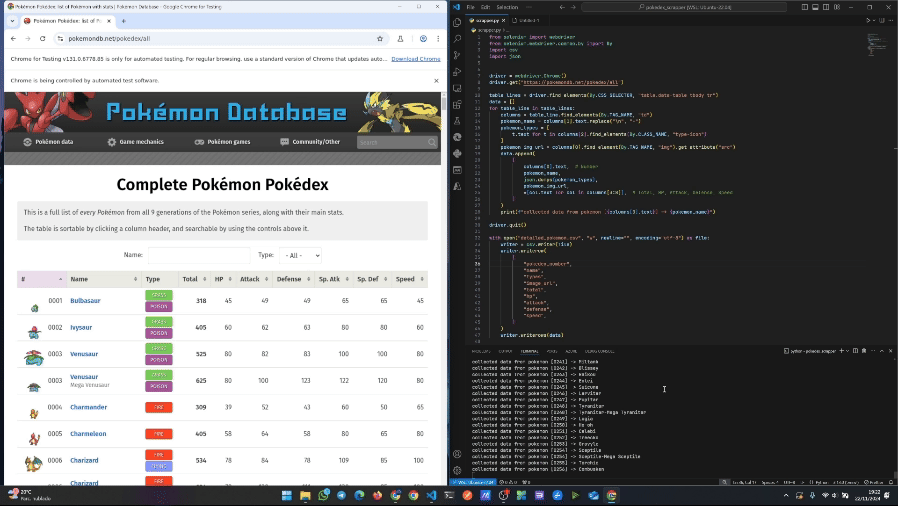
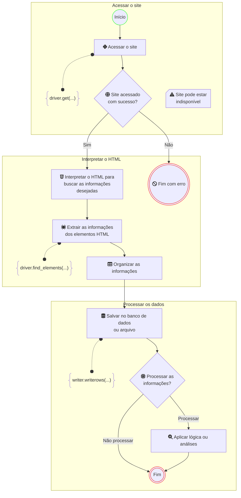

# 3 Maneiras de Coletar Dados de Sites

Este projeto demonstra **3 maneiras de coletar dados de sites** (_web scraping_), conforme apresentado em um vídeo no YouTube. Ele inclui exemplos práticos para ajudar a entender o funcionamento de cada abordagem.

> 📺 **Assista ao vídeo completo [aqui](https://youtu.be/7rAMR4xUR5A)**

---

## Demonstração

Veja o código em funcionamento:



---

## Os 3 passos principais de qualquer coletor de dados

Todo coletor de dados (_scraper_) pode ser dividido em 3 passos principais. Abaixo está o diagrama que ilustra esses passos, conforme explicado no vídeo:



---

## Instalando Dependências com pip e requirements.txt

Para instalar todas as dependências listadas no arquivo `requirements.txt` de uma só vez, você pode usar o comando: `python -m pip install -r requirements.txt`. Este é um método bem eficiente e simples para configurar ambientes de desenvolvimento Python.

1. Certifique-se de que você está no diretório do projeto onde o arquivo `requirements.txt` está localizado.
1. Crie um ambiente virtual (pasta `.venv`) com o seguinte comando no terminal:
    ```shell
    python -m venv .venv
    ```
1. Ative seu ambiente virtual (se estiver usando um):
    - Windows
        ```shell
        .\.venv\Scripts\activate.ps1
        ```
    - Ubuntu
        ```shell
        source .venv/bin/activate
        ```
1. Execute o seguinte comando no terminal:
    ```
    python -m pip install -r requirements.txt
    ```
1. O pip lerá o arquivo `requirements.txt` e instalará todas as dependências listadas nele.

---

## Executando o Projeto

Este projeto utiliza o Selenium, então é necessário ter o navegador [Google Chrome](https://support.google.com/chrome/answer/95346?hl=en&co=GENIE.Platform%3DDesktop) instalado. O código não pode ser executado em servidores sem interface gráfica, pois o Selenium interage diretamente com o navegador.

Para rodar o projeto:

1. Certifique-se de que as dependências foram instaladas.
1. Execute o comando abaixo no terminal:
    ```shell
    python scraper.py
    ```

> O navegador Chrome será aberto automaticamente durante a execução e será fechado ao final do processo.

---

## Licença

Este projeto está licenciado sob a [MIT License](https://opensource.org/license/mit).